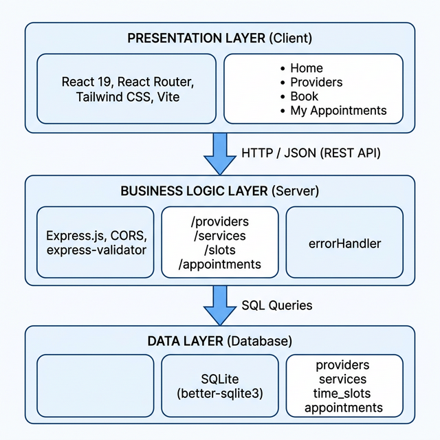
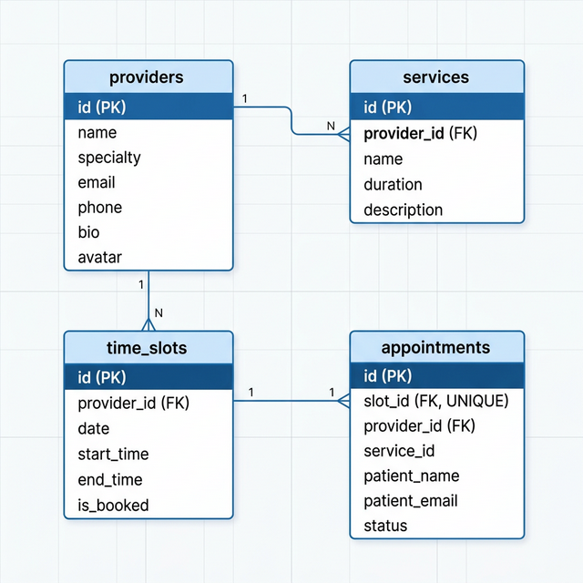

# Smart Appointment & Resource Allocation System

The Smart Appointment & Resource Allocation System is a web-based application that allows users to view available time slots, book appointments and manage cancellations, while service providers and administrators manage availability and resources.

## Project Overview
The Smart Appointment System is a web-based application designed to simplify and automate appointment scheduling between users and service providers. The system provides a centralized platform where users can view availability, book appointments, and receive confirmations, while service providers can manage schedules efficiently. The application follows modern software engineering practices, including containerization, CI/CD, and modular frontend–backend architecture.

---

## Problem It Solves
Many appointment-based services still rely on manual scheduling, phone calls, or basic spreadsheets. These approaches often lead to double bookings, inefficient time utilization, lack of real-time updates, and poor user experience. As the number of users grows, managing appointments manually becomes error-prone and difficult to scale.

---

## Target Users (Personas)

**End Users (Customers):**  
Individuals who want to book appointments quickly and conveniently without manual coordination. They expect a simple interface, clear availability information, and reliable confirmation.

**Service Providers / Administrators:**  
Professionals or organizations offering appointment-based services who need an organized way to manage schedules, avoid conflicts, and handle multiple bookings efficiently.

---

## Vision Statement
To build a reliable, user-friendly, and scalable appointment management system that streamlines scheduling, reduces manual effort, and improves the overall experience for both users and service providers.

---

## Key Features / Goals
- User-friendly web interface for booking appointments  
- Centralized backend service to manage appointment data  
- Real-time system health verification through APIs  
- Responsive frontend built with modern UI frameworks  
- Containerized deployment using Docker  
- Automated build and validation using CI/CD pipelines  

---

## Tech Stack

| Layer | Technology |
|-------|-----------|
| Frontend | React 19 + Vite + Tailwind CSS |
| Backend | Express.js (Node.js) |
| Database | SQLite (better-sqlite3) |
| DevOps | Docker Compose + GitHub Actions CI |

---

## Software Design

The system follows a **3-tier Layered (Client-Server) architecture** with clear separation between Presentation, Business Logic, and Data layers. Design decisions prioritize **modularity** (each route module handles one domain entity), **low coupling** (frontend communicates with the backend only through a centralized API abstraction), and **high cohesion** (every component has a single, well-defined responsibility).

### Architecture Diagram



> **Editable source:** [`docs/design/architecture.drawio`](docs/design/architecture.drawio)

### ER Diagram



### UI Screens

| Page | Description |
|------|-------------|
| Home | Hero section with gradient background, feature cards, and CTA buttons |
| Providers | Card grid with color-coded specialties and direct "Book" button |
| Booking | Multi-step wizard: Provider → Service → Date & Time → Details → Confirmation |
| My Appointments | Email-based lookup, appointment cards with status badges, cancel option |

> **Full design document:** [`docs/design/DESIGN.md`](docs/design/DESIGN.md)

### Key Design Decisions
1. **Separated route modules by domain** — Low coupling; adding features doesn't modify existing code  
2. **Centralized API abstraction** (`api.js`) — All backend communication flows through one file  
3. **Transactional booking** — SQLite transactions prevent double-booking race conditions  
4. **Centralized error handling** — Consistent JSON error responses across all endpoints  

---

## Quick Start

### Prerequisites
- Node.js 18+
- npm

### Run Locally

```bash

cd backend
npm install
node seed.js      
npm start         

cd frontend
npm install
npm run dev       
```

### Run with Docker

```bash
docker-compose up --build
```

---

## Success Metrics
- Successful booking and retrieval of appointments without conflicts  
- System availability verified through health-check APIs  
- Frontend and backend services running reliably in containers  
- CI pipeline passing on every push and pull request  
- Positive user feedback on ease of use and responsiveness  

---

## Assumptions & Constraints

**Assumptions**
- Users have access to a modern web browser  
- The system is deployed in a containerized environment  
- Internet connectivity is available for accessing the application  

**Constraints**
- Limited development time due to academic deadlines  
- Initial version focuses on core functionality rather than advanced analytics  
- Scalability and security enhancements are planned for future versions  

---

## MoSCoW Prioritization

**Must Have**  
- View available slots  
- Book appointment  
- Manage availability  
- Prevent double booking  

**Should Have**  
- Cancel appointment  
- View appointment history  
- Admin overview dashboard  

**Could Have**  
- Notifications  
- Reports and analytics  

**Won't Have**  
- Payment processing  
- External calendar integration  
